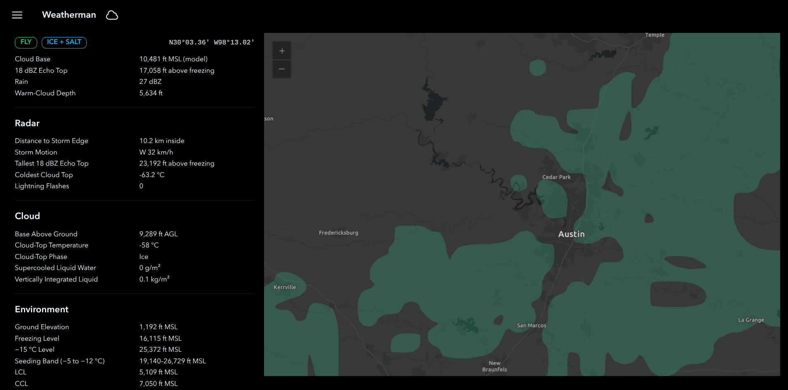

# Weatherman

Weatherman is a cloud seeding evaluation platform.

This platform sources data from National Oceanic and Atmospheric Administration (NOAA) data repositories, and renders them on a map.

Each data layer is additive, and a member in a set of criteria inspired by academic literature. The criteria compute a composite **seedability** layer. Candidates are a cloud formations whose physics are optimal targets for cloud seeding.

### Getting Started

In the root directory of this repository, run `docker compose build`, then `docker compose up`.

Navigate to `http://localhost:5173`.

### Data Sources

Weatherman draws data from three sources.

#### High-Resolution Rapid Refresh (HRRR)

HRRR is a NOAA weather model, which simulates the breadth and depth of atmospheric conditions across the United States. HRRR models cloud water content, the temperature profile, and cloud base altitude at 3km resolution.

#### Geostationary Operational Environmental Satellite - East (GOES-East)

GOES-East is a NOAA geostationary satellite fixed over a point at the equator, imaging the top of weather systems. It measures cloud-top pressure, and cloud-top phase at 2km resolution.

#### Multi-Radar/Multi-Sensor (MRMS)

MRMS is a NOAA product that stitches together a national ground radar mosaic into measurements at 1km resolution. It mosaics radar reflectivity echo, which is a proxy for moisture content, and sometimes rainfall.

### Evaluation

The codebase includes an evaluation harness that scores the seedability of every flare in a season.

Follow instructions on the [release](https://github.com/meteorology-sh/weatherman/releases/tag/eval-2025) to reproduce Weatherman's findings.
